title: 
Software Architecture Model of FruitDash by Daniel Travaglia
---
 
# Getting started

You will use [Markdown](https://www.markdownguide.org/cheat-sheetplan) and [PlantUML](https://plantuml.com/) to describe a software architecture model about your own project.

This document will grow during the semester as you sketch and refine your software architecture model.

When you are done with each task, please push so we can give you feedback about your work.

We begin by selecting a suitable project domain.


# Ex - Domain Selection 

{.instructions

Submit the name and brief description (about 100 words) of your domain using the following vision statement template:

```
For [target customers]
Who [need/opportunity/problem]
The [name your project]
Is  [type of project]
That [major features, core benefits, compelling reason to buy]
Unlike [current reality or competitors]
Our Project [summarize main advantages over status quo, unique selling point]
```

Please indicate if your choice is:

* a project you have worked on in the past (by yourself or with a team)
* a project you are going to work on this semester in another lecture (which one?)
* a new project you plan to build in the future
* some existing open source project you are interested to contribute to

The chosen domain should be unique for each student.

Please be ready to give a 2 minute presentation about it (you can use a slide but it's not necessary)

Hint: to choose a meaningful project look at the rest of the modeling tasks which you are going to perform in the context of your domain.

}

Project Name: *FruitDash*

Project Type: Web application

Vision Statement: 
  For small-medium enterprise employees, 
  who need to make decisions based on clear visualized information, 
  FruitDash is a web-based dashboard that displays metrics based on the fruit and vegetable orders of their clients.
  Unlike Excel, 
  Fruitdash provides the required information instantaneously to speed up the decision-making process
  and enables the sharing of consistent information across the whole company. 
   
Additional Information: This is a project that I aim to build in the future. The dashboard
should be accessible by multiple users at the same time and it should be built so that it respects
conventions on how information should be displayed using tables and graphs. Furthermore, the application
will be built using ASP.NET Core Framework (C#) and SQL Server as the database technology for retrieving data.

# Ex - Architectural Decision Records

{.instructions

Software architecture is about making design decisions that will impact the quality of the software you plan to build.

Let's practice how to describe an architectural decision. We will keep using ADRs to document architectural decisions in the rest of the model.

Use the following template to capture one or more architectural design decisions in the context of your project domain

Pass: 1 ADR

Good: 2 ADR

Exceed: >2 ADR

}

<!--  -->

## ADR #1

### 1. What did you decide?
<!-- Give a short title of solved problem and solution -->
I decided to adopt an external product as the go-to tool to develop the company dashboard.

### 2. What was the context for your decision?
<!-- What is the goal you are trying to achieve? -->
<!-- What are the constraints? -->
<!-- What is the scope of your decision? Does it affect the entire architecture? -->
We need to decide whether to adopt a third-party application or to build one from scratch. The factors involved in this decision are mainly to keep data consistent across users, make sure that multiple users can access the product concurrently as well as to provide simple yet captivating visualization. To consider is also that the data of the client is already stored in a Microsoft SQL Server database. This decision deeply influences the choices on the expertise needed to develop the project as well as the technology to adopt.

### 3. What is the problem you are trying to solve?
<!-- You may want to articulate the problem in form of a question. -->
Would it be better to adopt an already existing solution on top of which we can build our final product or should we opt for an in-house solution?

### 4. Which alternative options did you consider?
<!-- List at least 3 options -->
1. Internal solution: an Office Adds-in for Excel
2. Internal solution: a web framework solution 
3. External solution: Microsoft Power BI

### 5. Which one did you choose?
<!-- Pick one of the options as the outcome of your decision -->
I picked to go for the external solution and therefore adopt the Microsoft Power BI platform.

### 6. What is the main reason for that?
<!-- List the positive consequences (pros) of your decision: -->
<!-- quality improvement, satisfaction of external constraint. If any, list the negative consequences (cons), quality degradation -->
Microsoft Power BI provides a friendly and easy-to-use environment to create modern dashboards. Besides the possibility to share the dashboard with multiple users in real-time, the killer feature of this solution is the ability to translate natural language requests for scouting data. The tool provides a connector to extract data from Microsoft SQL database. Moreover, as the data stored has a low disk footprint and the tool subscription is free up to 1GB of data loaded per user, it also grants low costs. Providing the same features with a solution built from scratch might results in far greater costs and might also provide less features. On the other hand, it would grant more flexibility when it comes to personalize the dashboard for ad-hoc analyses.

## ADR #2

### 1. What did you decide?
<!-- Give a short title of solved problem and solution -->
<!-- Allow the download of Excel for the data that is visualized on the dashboard > -->
Allow the download of visualized data directly from the dashboard in Excel format. 

### 2. What was the context for your decision?
<!-- What is the goal you are trying to achieve? -->
<!-- What are the constraints? -->
<!-- What is the scope of your decision? Does it affect the entire architecture? -->
The context of this decision is to allow the user to download data directly from the dashboard so to enable further or even ad-hoc analysis on a specific context. It should be made simple for the user to use (e.g. an Excel icon button link to click) but it should not have an impact on the visualizations, which clearly has the priority. There is no impact on the architectural side of the application.

### 3. What is the problem you are trying to solve?
<!-- You may want to articulate the problem in form of a question. -->
Introduce flexibility in the data analysis process for the user. 

### 4. Which alternative options did you consider?
<!-- List at least 3 options -->
1. An external service that retrieve data directly from the database and produce an ad-hoc Excel file.
2. A Microsoft Power BI plug-in service
3. Set up a recurrent job / task on the already existing database server 

### 5. Which one did you choose?
<!-- Pick one of the options as the outcome of your decision -->
The Microsoft Power BI plug-in solution.

### 6. What is the main reason for that?
<!-- List the positive consequences (pros) of your decision: -->
<!-- quality improvement satisfaction of external constraint If any, list the negative consequences (cons) quality degradation -->
This decision will allow the user to perform further analysis on any piece of information that is identified from the visualizations provided. 

A clear negative consequence of this decision is the cost involved, as it consists of a premium SaaS feature of the Microsoft Power BI software.

## ADR #3

### 1. What did you decide?
<!-- Give a short title of solved problem and solution -->
Provide additional security thanks to 2-factors authentication.

### 2. What was the context for your decision?
<!-- What is the goal you are trying to achieve? -->
<!-- What are the constraints? -->
<!-- What is the scope of your decision? Does it affect the entire architecture? -->
The current infrastructure of the company is built in such a way that information security is clearly a priority. The goal here is to keep information protected yet easily accessible. However, protecting information often introduces slowtimes and reduces the product usability. Nevertheless, as the client is particularly sensible to this topic, reduced usability should not represent a big problem.

### 3. What is the problem you are trying to solve?
<!-- You may want to articulate the problem in form of a question. -->
Keeping information secure.

### 4. Which alternative options did you consider?
<!-- List at least 3 options -->
1. SMS external provider 2-factors authentication
2. Microsoft Authentication service
3. Multi-factor authentication for Power BI

### 5. Which one did you choose?
<!-- Pick one of the options as the outcome of your decision -->
Multi-factor authentication for Power BI.

### 6. What is the main reason for that?
<!-- List the positive consequences (pros) of your decision: -->
<!-- quality improvement satisfaction of external constraint If any, list the negative consequences (cons) quality degradation -->
Two-factors authentication adds a layer of protection as to ensure the identify of the user and that the user has authorization to access the dashboard. On the other hand, it decreases usability and might have an impact on the usage frequency of the dashboard. 


# Ex - Quality Attribute Scenario

{.instructions

1. Pick a scenario for a specific quality attribute. Describe it with natural language.

2. Refine the scenario using the following structure:

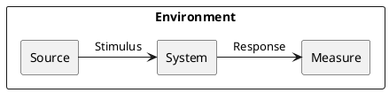

*Stimulus*: condition affecting the system

*Source*: entity generating the stimulus

*Environment*: context under which stimulus occurred (e.g., build, test, deployment, startup, normal operation, overload, failure, attack, change)

*Response*: observable result of the stimulus

*Measure*: benchmark or target value defining a successful response

Pass: 3 scenarios

Good: >3 scenarios

Exceed: >6 scenarios using challenging qualities

}

<!-- ## Example Scenario

Quality: _Recoverability_

Scenario: In case of power failure, rebooting the system should take up to 20 seconds.

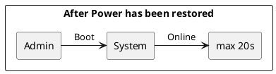
  -->

## Scenario 1

Quality: _Compatibility_

Scenario: The user should be able to access the dashboard from any device.

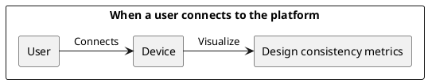

## Scenario 2

Quality: _Security_

Scenario: When the user authenticate, two-factor-authentication should fail with more than 3 attempts. 

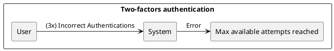

<!-- {.feedback

Make the refined scenario more precise

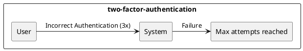

} -->

## Scenario 3

Quality: _Capacity_

Scenario: The system should be able to handle requests from the maximum user's capacity of 100 users simultaneously.    

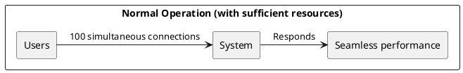


<!-- {.feedback

Make the refined scenario more precise

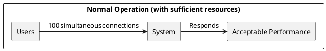

} -->

## Scenario 4

Quality: _Ease of Integration_

Scenario: It should be possible to retrieve the same application underlying data with 1 single consistent API.

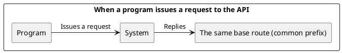

## Scenario 5

Quality: _Ease of Support_

Scenario: In case of service failure, the user should receive support within 30 minutes. 

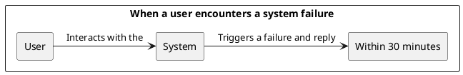

## Scenario 6

Quality: _Time To Market_

<!-- {.feedback

Better quality:

- Time to Market

since no budget or cost is mentioned in the scenario

} -->

Scenario: As per customer request, the software should be ready within 4 months.

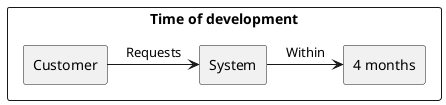

## Scenario 7

Quality: _Privacy_

Scenario: As per customer request, when an account is canceled, all the related data should be deleted immediately.

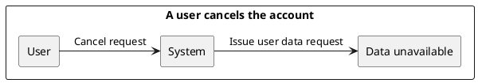

# Ex - Quality Attribute Tradeoff

{.instructions

Pick a free combination of two qualities on the [map](https://usi365.sharepoint.com/:x:/s/MSDE-2022-SoftwareArchitecture/ESVksoXVgMNHtKBKrIwatMYBqorOFaKjxnoqssEy0gNPCg?e=81W7SI) and write your name to claim it.

Then write a short text giving an example for the tradeoff in this assignment.

Pass: 1 unique trade-off

Good: 2 trade-offs

Exceed: >2 trade-offs

}

<!-- ## Portability vs. Performance (Example)

Developing an app natively for each OS is expensive and time consuming, but it benefits from a good performance. Choosing a cross-platform environment on the other hand simplify the development process, making it faster and cheaper, but it might suffer in performance. -->

## Feasibility vs. Defensibility

On one hand, we need to ensure that the software is protected from every possible external attack. However, to achieve this objective, time and money investments are critical, which would make the system less feasible. On the other hand, a developer would like to build an affordable architecture with the shortest possible time to market, often compromising defensibility.

## Reliability vs. Scalability

During development phase, one of the underlying objective of a developer is to make a system reliable, so that failures happen unfrequently. Nevertheless, if the focus shifts to scalable application, reliability might deteriorate. The software would have to deal with an increasing amount of requests and as such, failures would naturally occur more frequently.

## Compatibility vs. Modifiability

Ensuring that the user can access an application from multiple devices might lead to an increase in software's usability and flexibility, but it could also introduce design complexity and make it difficult to update the software. On the other hand, the developer could add additional features to the architecture, but would need to make sure that these changes are applied uniformly across the whole range of devices a user can use.

<!-- TODO -->
# Ex - Feature Modeling

{.instructions

In the context of your chosen project domain, describe your domain using a feature model.

The feature model should be correctly visualized using the following template:


If possible, make use of all modeling constructs.

Pass: Include at least 4 non-trivial features

Good: Include at least 6 non-trivial features, which are all implemented by your project

Exceed: Include more than 8 non-trivial features, indicate which are found in your project and which belong to one competitor

}


# Ex - Context Diagram

{.instructions

Prepare a context diagram to define the design boundary for your project.

Here is a PlantUML/C4 example to get started.


Make sure to include all possible user personas and external dependencies you may need.

Pass: 1 User and 1 Dependency

Good: >1 User and >1 Dependency

Exceed: >1 User and >1 Dependency, with both incoming and outgoing dependencies

}


# Ex - Component Model: Top-Down

{.instructions

Within the context of your project domain, represent a model of your modular software architecture decomposed into components.

The number of components in your logical view should be between 6 and 9:

- At least one component should be further decomposed into sub components
- At least one component should already exist. You should plan how to reuse it, by locating it in some software repository and including in your model the exact link to its specification and its price.
- At least one component should be stateful.

The logical view should represent provide/require dependencies that are consistent with the interactions represented in the process view.

The process view should illustrate how the proposed decomposition is used to satisfy the main use case given by your domain model.

You can add additional process views showing how other use cases can be satisfied by the same set of components.

This assignment will focus on modularity-related decisions, we will worry about deployment and the container view later.

Here is a PlantUML example logical view and process view.

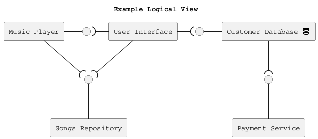

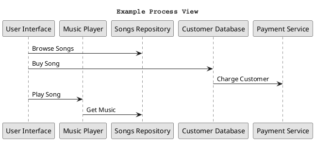

Hint: How to connect sub-components to other external components? Use this pattern.

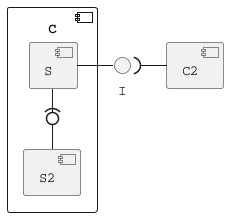

Pass: 6 components (1 decomposed), 1 use case/process view

Good: 6 components (1 decomposed), 2 use case/process view

Exceed: >6 components (>1 decomposed) and >2 use case/process view

}

## Logical View


<!-- {.feedback

Check and correct the dependencies. X )- Y indicates that Y requires what X provides. If X )- Y in the logical view, the process view should consistently show that Y -> X, Y calls X and not the other way around.

Also each component should have a distinct interface.

} -->

## Process Views

First Use Case: 


Second Use Case: 


Third Use Case: 


# Ex - Component Model: Bottom-Up

{.instructions

Within the context of your project domain, represent a model of your modular software architecture decomposed into components.

To design this model you should attempt to buy and reuse as many components as possible.

In addition to the logical and process views, you should give a precise list to all sources and prices of the components you have selected to be reused.

Write an ADR to document your component selection process (indicating which alternatives were considered).

Pass: Existing design with at least 1 reused components (1 Logical View, 1 Process View)

Good: Existing design with at least 3 reused components (1 Logical View, 1 Process View, 1 ADR)

Exceed: Redesign based on >3 reused components (1 Logical View, >1 Process View, >1 ADR)

}

Reused Components List

* [SQL Server Standard](https://www.microsoft.com/it-it/sql-server/sql-server-downloads)
* [Power BI](https://powerbi.microsoft.com/it-ch/)
<!-- * [Power BI - In-app Excel Analyzer](https://docs.microsoft.com/en-us/power-bi/collaborate-share/service-analyze-in-excel) -->
* [Power BI - Excel data extractor](https://docs.microsoft.com/en-us/power-bi/collaborate-share/service-connect-power-bi-datasets-excel)
* [Azure Active Directory](https://azure.microsoft.com/en-us/services/active-directory/#features)
* [ASP.NET - Web API](https://docs.microsoft.com/en-us/aspnet/core/tutorials/first-web-api?view=aspnetcore-6.0&tabs=visual-studio)


# Ex - Interface/API Specification

{.instructions

In this iteration, we will detail your previous model to specify the provided interface of all components based on their interactions found in your existing process views.

1. choose whether to use the top down or bottom up model. If you specify the interfaces of the bottom up model, your interface descriptions should match what the components you reuse already offer.

2. decide which interface elements are operations, properties, or events.

Get started with one of these PlantUML templates, or you can come up with your own notation to describe the interfaces, as long as it includes all the necessary details.

The first template describes separately the provided/required interfaces of each component. 


The second template annotates the logical view with the interface descriptions: less redundant, but needs the logical dependencies to be modeled to show which are the required interfaces.


Pass: define interfaces of all outer-level components

Good: Define interfaces of all outer-level components. Does your architecture publish a Web API? If not, extend it so that it does. 

Exceed: Also, document the Web API using the OpenAPI language. You can use the [OpenAPI-to-Tree](http://api-ace.inf.usi.ch/openapi-to-tree/) tool to visualize the structure of your OpenAPI description.

}

# Ex - Connector View

{.instructions

Extend your existing models introducing the connector view

For every pair of connected components (logical view), pick the most suitable connector. Existing components can play the role of connector, or new connectors may need to be introduced.

Make sure that the interactions shown in the process views reflect the primitives of the selected connector

Pass: model existing connectors based on previous model decisions

Good: model existing connectors based on previous model decisions, write an ADR about the choice of one connector

Exceed: introduce a new type of connector and update your existing process view 
(sequence diagram) to show the connector primitives in action

}

# Ex - Adapters and Coupling

{.instructions

1. Highlight the connectors (or components) in your existing bottom-up design playing the role of adapter. (We suggest to use the bottom-up design since when dealing with externally sourced components, their interfaces can be a source of mismatches).
2. Which kind of mismatch** are they solving?
3. Introduce a wrapper in your architecture to hide one of the previously highlighted adapters
4. Where would standard interfaces play a role in your architecture? Which standards could be relevant in your domain?
5. Explain how one or more pairs of components are coupled according to different coupling facets
6. Provide more details on how each adapter solves the mismatches identified using pseudo-code or the actual code
7. How can you improve your architectural model to minimize coupling between components? (Include a revised logical/connector view with your solution)

Pass: 1-5 (with one adapter)

Good: 1-6 (with at least two adapters)

Exceed: 1-7 (with at least two adapters)

** If you do not find any mismatch in your existing design we suggest to introduce one artificially.

## Hints

* (1) Should we find cases where two components cannot communicate (and are doing it wrongly) and highlight they would need an adapter?, or cases where we have already a "component playing the role of adapter in the view" and highlight only the adapter?

  *Both are fine. We assumed that if you draw a dependency (or a connector) the interfaces match, but if you detect that the components that should communicate cannot communicate then of course introduce an adapter to solve the mismatch*

* (2) Please show the details about the two interfaces which do not match (e.g., names of parameters, object structures) so that it becomes clear why an adapter is needed and what the adapter should do to bridge the mismatch

* (5-6) These questions are about the implications on coupling based on the decisions you documented in the connector view.
Whenever you have a connector you couple together the components and different connectors will have different forms of coupling

  For example, if you use calls everywhere, do you really need them everywhere? is there some pair of components where you could use a message queue instead?

  Regarding the coupling facets mentioned in question 5. You do not have to answer all questions related to "discovery", "session", "binding", "interaction", "timing", "interface" and "platform" (p.441, Coupling Facets). Just the ones that you think are relevant for your design and by answering them you can get ideas on how to do question 6.

}

# Ex - Physical and Deployment Views

{.instructions

a. Extend your architectural model with the following viewpoints:

1. Physical or Container View

2. Deployment View

Your model should be non-trivial: include more than one physical device/virtual container (or both). Be ready to discuss which connectors are found at the device/container boundaries.

b. Write an ADR about which deployment strategy you plan to adopt. The alternatives to be considered are: big bang, blue/green, shadow, pilot, gradual phase-in, canary, A/B testing.

c. (Optional) Prepare a demo of a basic continuous integration and delivery pipeline for your architectural documentation so that you can obtain a single, integrated PDF with all the viewpoints you have modeled so far. 

For example:

- configure a GitHub webhook to be called whenever you push changes to your documentation
- setup a GitHub action (or similar) to build and publish your documentation on a website

Pass: 1 physical view, 1 deployment view, 1 ADR (b.)

Good: >1 physical view, >1 deployment view, 1 ADR (b.)

Exceed: 1 physical view, 1 deployment view, 1 ADR (b.) + 1 demo (c.)

}

# Ex - Availability and Services

{.instructions 

The goal of this week is to plan how to deliver your software as a service with high availability.

1. If necessary, change your deployment design so that your software is hosted on a server (which could be running as a Cloud VM). Your SaaS architecture should show how your SaaS can be remotely accessed from a client such as a Web browser, or a mobile app
2. Sketch your software as a service pricing model (optional)
3. How would you define the availability requirements in your project domain? For example, what would be your expectation for the duration of planned/unplanned downtimes or the longest response time tolerated by your clients?
4. Which strategy do you adopt to monitor your service's availability? Extend your architecture with a watchdog or a heartbeat monitor and motivate your choice with an ADR.
5. What happens when a stateless component goes down? model a sequence diagram to show what needs to happen to recover one of your critical stateless components
6. How do you plan to recover stateful components? write an ADR about your choice of replication strategy and whether you prefer consistency vs. availability. Also, consider whether event sourcing would help in your context.
7. How do you plan to avoid cascading failures? Be ready to discuss how the connectors (modeled in your connector view) impact the reliability of your architecture.
8. How did you mitigate the impact of your external dependencies being not available? (if applicable)

Pass: 1, 3, 4, one of:  5, 6, 7, 8

Good: 1, 2, 3, 4, two of:  5, 6, 7, 8

Exceed: 1, 2, 3, 4, 5, 6, 7, 8

}

# Ex - Scalability

{.instructions 

Now that your architecture delivers your software as a service, let's redesign it so that it can scale!

1. Pick one scalability dimension: number of clients, size of input, size of state, number of dependencies

2. How well does your architecture scale along the chosen dimension? Where do you expect the bottleneck to be?

3. Modify your architecture to remove the scalability bottleneck you have identified (show both logical, process and deployment view) - consider whether the API/interface of the bottleneck component should be improved.

4. Write an ADR regarding the scalability pattern you have introduced.

5. Write an ADR regarding the issue of component discovery, choosing one of the alternatives: dependency injection vs. directory. Can you identify an existing component playing the role of directory/dependency injection container? Could you give an example of where you would need to add such component to facilitate dynamic component discovery?

Pass: 1, 2, 3, 5

Good: 1, 2, 3, 4, 5

Exceed: 1, 2, 3, 4, 5 then redo 1, 2, 3 for different scalability dimensions

}

# Ex - Flexibility

{.instructions 

Only dead software stops changing. You just received a message from your customer, they have an idea. Is your architecture ready for it?

1. Pick a new use case scenario. Precisely, what exactly do you need to change of your existing architecture so that it can be supported? Model the updated logical/process/deployment views.

2. Pick another use case scenario so that it can be supported without any major architectural change (i.e., while you cannot add new components, it is possible to extend the interface of existing ones or introduce new dependencies). Illustrate with a process view, how your previous design can satisfy the new requirement.

3. Change impact. One of your externally sourced component/Web service API has announced it will introduce a breaking change. What is the impact of such change? How can you control and limit the impact of such change? Update your logical view

4. Open up your architecture so that it can be extended with plugins by its end-users. Where would be a good extension point? Update your logical view and give at least one example of what a plugin would actually do.

5. Assuming you have a centralized deployment with all stateful components storing their state in the same database, propose a strategy to split the monolith into at least two different microservices. Model the new logical/deployment view as well as the interfaces of each microservice you introduce.

Pass: 1, one out of 2-5.

Good: 1, two out of 2-5.

Exceed: 1-5.

}